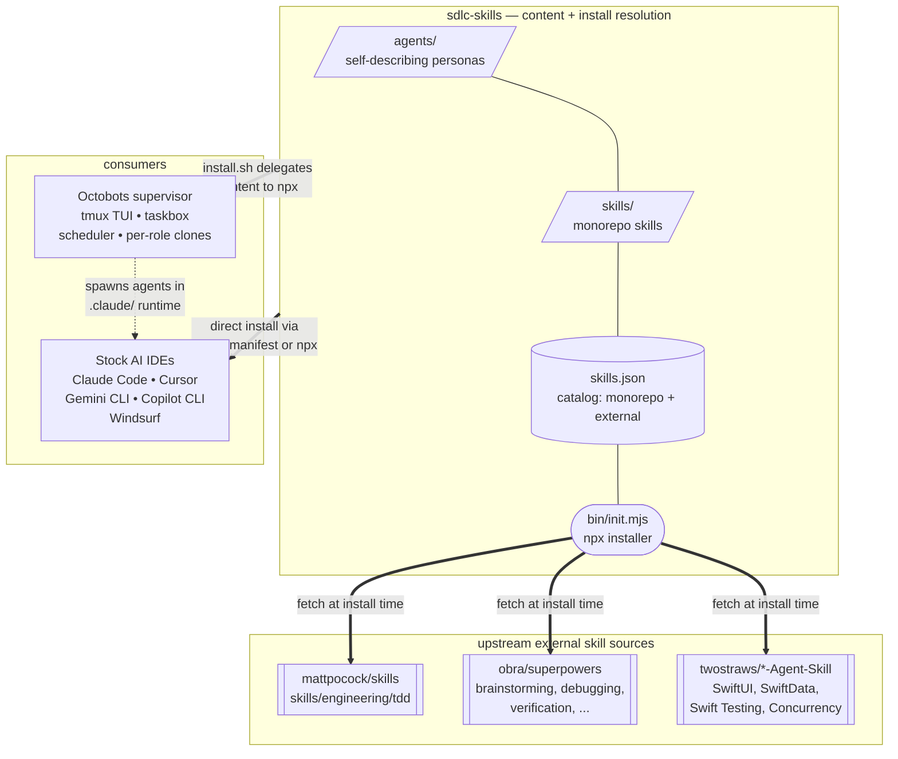

# sdlc-skills

**The content layer for AI-assisted software delivery.** Role-based agent
personas (BA, Tech Lead, PM, devs, QA, PA), workflow skills (TDD,
bugfix, code review, task completion, memory, …), and a registry that
pulls proven skills from Matt Pocock, Jesse Vincent (obra/superpowers),
and Paul Hudson so you don't have to reinvent them.

Two consumers:

- **Any AI IDE** (Claude Code, Cursor, Gemini CLI, GitHub Copilot CLI,
  Windsurf, Codex) — install via the npx one-shot or a native plugin
  manifest. Use the agents + skills directly.
- **[Octobots supervisor](https://github.com/arozumenko/octobots)** —
  wraps this repo with orchestration (tmux TUI, taskbox, scheduler,
  per-role git clones). `octobots/install.sh` delegates all content
  resolution here.

## Architecture



(Node shapes convey grouping so colors aren't needed: `/ /` parallelograms
for content dirs, `( )` round-ended for the installer, cylinders for the
registry, `[[ ]]` subroutines for external sources. GitHub's Mermaid
renderer uses theme-adaptive colors in both light and dark mode.)

Agents are **self-describing** — each `agents/<name>/AGENT.md` carries
its own metadata (role, group, theme, aliases, skills, model). Octobots
reads it at runtime; IDE plugin systems read it at install time. Nothing
duplicated.

External skills (Matt Pocock's `tdd`, Jesse Vincent's `brainstorming` /
`systematic-debugging` / etc., Paul Hudson's Swift skills) live in their
upstream repos. The installer resolves each agent's declared skill list
against `skills.json`, clones external repos on first install into
`~/.cache/sdlc-skills/registry/`, and symlinks the subdir into your
project's skills directory.

## What lands in your project

After `npx … init` + a scout run, your target project has two top-level
directories plus the IDE's native install location:

```
your-project/
├── .claude/                  ← IDE-native install (or .cursor/, .windsurf/, .github/)
│   ├── agents/<role>/        agent config (AGENT.md + SOUL.md)
│   └── skills/<name>/        skill content (SKILL.md + references)
│
├── .agents/                  ← IDE-neutral content — every agent reads
│   ├── profile.md            scout output: project card
│   ├── architecture.md       scout output: system design
│   ├── conventions.md        scout output: coding standards
│   ├── testing.md            scout output: test infrastructure
│   ├── team-comms.md         scout output: transport + roster
│   ├── onboarding.md         scout's audit trail
│   └── memory/<role>/        memory-skill dir: MEMORY.md index,
│                             curated entries (incl. scout-seeded
│                             project_briefing.md), daily/, snapshot.md
│
├── .octobots/                ← supervisor runtime state (only if Octobots is installed)
│   ├── relay.db              taskbox SQLite
│   ├── board.md              team whiteboard
│   ├── workers/<role>/       isolated worker environments + git clones
│   ├── roles/                project role overrides
│   ├── registry/             cached third-party agent/skill clones
│   ├── schedule.json         persistent cron jobs
│   └── roles-manifest.yaml   check-spawn-ready.py input (scout-generated)
│
├── AGENTS.md                 scout output: full team reference
└── CLAUDE.md                 scout output: 80-line auto-loaded context
```

**The rule.** `.agents/` holds content agents read. `.octobots/` holds
supervisor runtime state. Nothing in `.agents/` needs the supervisor to
function; nothing in `.octobots/` is meaningful without it. That split
is why `.agents/memory/<role>/` works identically under Claude Code,
Cursor, Gemini CLI, Copilot CLI, Windsurf, and Octobots.

Scout (`scout` agent, run once when onboarding) populates everything
under `.agents/` plus `AGENTS.md` / `CLAUDE.md` at the root. Re-run
scout whenever the stack evolves to refresh.

## Install — pick one path

There are really two paths: the **full experience** (npx installer or
Octobots) and the **monorepo-only fallbacks** (native IDE plugins for
people who don't want to be happy).

| Path | Fetches external skills? | When to pick |
|---|---|---|
| **npx installer** ⭐ | ✅ Yes | Any IDE. Full catalog. One command. This is the happy path. |
| **Octobots supervisor** ⭐ | ✅ Yes (delegates to npx) | You want multi-agent orchestration — tmux TUI, taskbox, scheduler, per-role git clones. |
| Native IDE plugins | ❌ Monorepo only | You don't want Node installed. Trade-off: no external skills, manual team assembly. |

> **Onboarding a test-automation pilot?** Existing framework, existing app,
> existing MCP connectors? See
> [`TEST-AUTOMATION-ONBOARDING.md`](TEST-AUTOMATION-ONBOARDING.md) for the
> end-to-end step-by-step: install → MCP inventory → scout seed →
> `.agents/test-automation.yaml` → single-case pilot → scale-up.

> **Why the split?** The native IDE plugin systems (Claude Code, Cursor,
> Gemini CLI, Copilot CLI) only see skills present in this repo's
> `skills/` directory — they don't know how to fetch from upstream. The
> npx installer and Octobots read `skills.json` and resolve external
> dependencies automatically (Matt Pocock's TDD, Jesse Vincent's
> debugging skills, Paul Hudson's Swift skills). If you want the full
> catalog, use one of the ⭐ paths.

### 1. npx installer (recommended)

One command installs agents, their declared monorepo skills, and their
external skills together. Works for Claude Code, Cursor, Windsurf, and
GitHub Copilot (all four IDE targets detected automatically).

```bash
# Full catalog, all detected IDEs
npx github:arozumenko/sdlc-skills init --all

# A specific team — every declared skill comes along automatically
# (monorepo + external, via git clone + symlink for externals)
npx github:arozumenko/sdlc-skills init --agents ba,tech-lead,ios-dev

# Specific skills (overrides the auto-resolve)
npx github:arozumenko/sdlc-skills init --skills bugfix-workflow,code-review

# Narrow to one IDE target
npx github:arozumenko/sdlc-skills init --agents ios-dev --target claude

# Update an existing install
npx github:arozumenko/sdlc-skills init --all --update
```

Install locations:

| Target | Directory | Drop path |
|---|---|---|
| Claude Code | `.claude/` | `.claude/agents/<name>/`, `.claude/skills/<name>/` |
| Cursor | `.cursor/` | `.cursor/agents/<name>/`, `.cursor/skills/<name>/` |
| Windsurf | `.windsurf/` | `.windsurf/agents/<name>/`, `.windsurf/skills/<name>/` |
| GitHub Copilot CLI | `.github/` | `.github/agents/<name>.agent.md` (flat file), `.github/skills/<name>/` |

**Copilot CLI note.** Copilot CLI expects agents as flat
`<name>.agent.md` files, not as directories. The installer handles this
automatically when `--target copilot` is selected: it flattens
`AGENT.md` + `SOUL.md` into a single file with a `## Persona` section,
and rewrites `model: sonnet` → `model: claude-sonnet-4.6` so Copilot CLI
picks a concrete model. The other targets keep the directory layout.

**Skills-inventory injection (non-Claude targets).** Claude Code
preloads each SKILL.md declared in the agent's `skills:` frontmatter
directly into the subagent's context at startup, so the agent already
has the skill content before it reads its own AGENT.md. Copilot CLI,
Cursor, and Windsurf have no documented preload — Copilot silently
discards unknown frontmatter keys. The installer fills the gap only
where it exists: for Copilot / Cursor / Windsurf targets, every
installed AGENT.md gets a bracketed `<!-- SKILLS-INJECTED: START -->`
section listing declared skills with their descriptions from
`skills.json`. Claude Code agents do not receive this section (it
would duplicate the preload). The block is idempotent on `--update` —
re-runs replace in place, never duplicate.

External skills are symlinked into the skills dir from the shared cache
at `~/.cache/sdlc-skills/registry/<owner>__<repo>/`. Override the cache
location with `SDLC_SKILLS_CACHE_DIR` or `XDG_CACHE_HOME`.

Run `npx github:arozumenko/sdlc-skills init --help` for the full flag list.

### Repairing an existing Copilot CLI install — `fix-copilot`

If a project already has agents installed as directories under
`.github/agents/<name>/` (older sdlc-skills release, manual drop,
install from upstream before this fix landed), run:

```bash
npx github:arozumenko/sdlc-skills init fix-copilot
```

This scans `.github/agents/`, flattens each directory into
`<name>.agent.md`, and rewrites the `model:` line for Copilot
compatibility. Four modes for handling the paired `SOUL.md`:

| `--soul <mode>` | What happens to `SOUL.md` |
|---|---|
| `memory` (default) | Relocated to `.agents/memory/<name>/SOUL.md` (IDE-neutral per-role dir, co-located with memory-skill content); source directory removed; in-file reference rewritten as an `@`-prefixed auto-import (matches the existing `@.agents/memory/<name>/snapshot.md` convention) |
| `inline` | Appended as `## Persona` inside the flat agent file; source directory removed |
| `keep` | Left in place at `<name>/SOUL.md`; flat agent file's reference rewritten |
| `sibling` | Moved to `<name>.soul.md` next to the agent file; reference rewritten |

Add `--dry-run` to preview, or `--no-normalize-model` to keep the
original `model:` value. Full help: `init fix-copilot --help`.

### 2. Octobots supervisor

If you want multi-agent orchestration (tmux panes per role, SQLite
taskbox for inter-role messaging, per-dev git clones, Rich TUI,
scheduled jobs), install the [Octobots supervisor](https://github.com/arozumenko/octobots)
into your project. Its `install.sh` runs the npx installer above as its
content step, then layers `.octobots/` runtime on top.

```bash
curl -fsSL https://raw.githubusercontent.com/arozumenko/octobots/main/install.sh | bash
```

### 3. Monorepo-only fallbacks (for when you refuse to install Node)

Each of these paths reads the native plugin manifest this repo ships and
installs **only the skills present in `skills/`** — external skills
(Matt Pocock's TDD, the superpowers skills, the twostraws Swift skills)
are not fetched. If you want those, go back to path 1 or 2.

**Claude Code plugin marketplace** — `.claude-plugin/marketplace.json`

```bash
/plugin marketplace add arozumenko/sdlc-skills
/plugin install sdlc-skills@sdlc-skills
# Or individual entries: /plugin install sdlc-skills@ios-dev  etc.
```

**Cursor native plugin** — `.cursor-plugin/plugin.json`

Point Cursor's plugin manager at this repo URL; it reads the manifest
and installs skills + agents from `./skills/` and `./agents/`.

**Gemini CLI extension** — `gemini-extension.json` + `GEMINI.md`

```bash
gemini extensions install https://github.com/arozumenko/sdlc-skills
```

The `GEMINI.md` context file catalogs every agent and skill for on-demand
loading.

**GitHub Copilot CLI / generic** — `AGENTS.md`

`AGENTS.md` at the repo root describes the content for any tool that
follows the AGENTS.md convention. Copilot CLI reads it when the repo is
cloned into your project.

### 4. agentskills.io / third-party consumption

Every skill under `skills/<name>/` follows the
[agentskills.io](https://agentskills.io) spec — `SKILL.md` with
`name` + `description` frontmatter. Any skill runtime (Vercel, custom
frameworks, other IDEs) can point directly at `skills/<name>/`.

## Catalog

### Agents (10)

| Agent | Persona | Role |
|---|---|---|
| `ba` | Alex | Business analyst — turns requirements into user stories with acceptance criteria |
| `tech-lead` | Rio | Decomposes user stories into technical tasks with dependencies; owns framework-scale decisions for test automation |
| `project-manager` | Max | Distributes tasks, tracks team state, escalates blockers, owns the merge gate |
| `python-dev` | Py | Python implementation — owns its own repo clone and branch |
| `js-dev` | Jay | JavaScript / TypeScript implementation — owns its own repo clone and branch |
| `ios-dev` | Io | iOS/Swift implementation — SwiftUI, SwiftData, Swift Testing (no simulator) |
| `qa-engineer` | Sage | Tests PRs, reports findings, executes TMS cases and emits Automation-Friendly Specs via the `test-case-analysis` skill |
| `test-automation-engineer` | Axel | Implements automation from AFS specs in the project's existing framework (Playwright / Cypress / pytest / JUnit / NUnit / WDIO) |
| `scout` | Kit | Maps unfamiliar codebases — explores, documents patterns, flags risks |
| `personal-assistant` | Octo | Conversational assistant: vault, email, calendar, daily brief |

### Monorepo skills

**SDLC-coupled (7):**

| Skill | What it does |
|---|---|
| `plan-feature` | Feature planning workflow used by BA / Tech Lead |
| `implement-feature` | Feature implementation workflow used by devs |
| `bugfix-workflow` | Structured bug investigation: reproduce → root cause → fix → regression test |
| `test-case-analysis` | Execute a TMS case, capture stable selectors, flag defects, emit an Automation-Friendly Spec (AFS). Used by qa-engineer |
| `test-automation-workflow` | End-to-end test automation — explore → specify (AFS) → implement → review. Pluggable TMS adapters (Zephyr / TestRail / Xray / Azure / markdown) over HTTP or MCP |
| `project-seeder` | Scout's project onboarding / configuration flow |
| `task-completion` | Five-step task completion protocol: verify → commit → PR → comment → notify |

**Generic dev skills (14):**

| Skill | What it does |
|---|---|
| `code-review` | Structured code review checklist and reporting |
| `git-workflow` | Branching, commits, PR conventions |
| `playwright-testing` | E2E browser testing with Playwright |
| `browser-verify` | Quick visual / smoke verification in a browser |
| `issue-tracking` | GitHub / Linear / GitLab issue management |
| `xray-testing` | Xray CRUD + results import — Tests, Preconditions, Test Sets/Plans, Executions, Runs. Xray Cloud (GraphQL) + Server/DC (REST). Stdlib Python CLI fallback |
| `atlassian-content` | Jira issue/comment authoring (ADF, API v3) + Confluence pages (storage format) with accountId mentions and post-creation verification |
| `tosca-automation` | Tricentis TOSCA Cloud full lifecycle — TestCases, Modules (Html + SapEngine), Reusable Blocks, Playlists, Inventory/folders, TSU import/export. Bundled Typer CLI (`tosca_cli.py`) |
| `goal-verifier` | Verify a task actually achieved its stated goal |
| `context-gatherer` | Targeted codebase exploration before changes |
| `deep-research` | Multi-source research and synthesis |
| `memory` | Persistent file-based memory across conversations |
| `obsidian-vault` | Read / write the user's Obsidian second brain |
| `msgraph` | Microsoft Graph (email / calendar / Teams) integration |

### External skills (fetched by the installer)

Declared in `skills.json` with `repo:` + optional `subdir:`. The npx
installer clones each into `~/.cache/sdlc-skills/registry/` on first
install and symlinks the subdir into your project's skills dir. Native
IDE plugin paths do **not** fetch these — use the installer for the full
catalog.

| Skill | Source | Used by |
|---|---|---|
| `tdd` | [`mattpocock/skills`](https://github.com/mattpocock/skills) → `skills/engineering/tdd/` | `python-dev`, `js-dev`, `ios-dev` |
| `brainstorming` | [`obra/superpowers`](https://github.com/obra/superpowers) → `skills/brainstorming/` | `ba` |
| `systematic-debugging` | [`obra/superpowers`](https://github.com/obra/superpowers) → `skills/systematic-debugging/` | devs + `qa-engineer` |
| `verification-before-completion` | [`obra/superpowers`](https://github.com/obra/superpowers) → `skills/verification-before-completion/` | devs + `qa-engineer` |
| `requesting-code-review` | [`obra/superpowers`](https://github.com/obra/superpowers) → `skills/requesting-code-review/` | devs |
| `receiving-code-review` | [`obra/superpowers`](https://github.com/obra/superpowers) → `skills/receiving-code-review/` | devs |
| `writing-skills` | [`obra/superpowers`](https://github.com/obra/superpowers) → `skills/writing-skills/` | `tech-lead` |
| `swiftui-pro` | [`twostraws/SwiftUI-Agent-Skill`](https://github.com/twostraws/SwiftUI-Agent-Skill) | `ios-dev` |
| `swiftdata-pro` | [`twostraws/SwiftData-Agent-Skill`](https://github.com/twostraws/SwiftData-Agent-Skill) | `ios-dev` |
| `swift-testing-pro` | [`twostraws/Swift-Testing-Agent-Skill`](https://github.com/twostraws/Swift-Testing-Agent-Skill) | `ios-dev` |
| `swift-concurrency-pro` | [`twostraws/Swift-Concurrency-Agent-Skill`](https://github.com/twostraws/Swift-Concurrency-Agent-Skill) | `ios-dev` |

## Using outside Octobots

These agents and skills install cleanly into stock Claude Code / Cursor
/ Windsurf / Copilot. A BA can draft stories, a tech-lead can review a
PR, `plan-feature` and `bugfix-workflow` run end-to-end with just `git`
and `gh`. A few pieces assume Octobots is running underneath — the
shape of those assumptions is documented below.

**Frontmatter extensions the supervisor owns:**

| Key | Stock-Claude behavior |
|---|---|
| `workspace: clone` | Ignored. Without Octobots, devs share your working tree — coordinate merges manually. |
| `skills: [taskbox, memory, ...]` | `taskbox` is bundled *inside* the Octobots supervisor — it's a no-op on stock Claude Code. `memory` is published here and works standalone. |

**`@import` paths auto-loaded at session start:**

```markdown
@.agents/memory/<role>/snapshot.md
```

Under Octobots the supervisor regenerates `snapshot.md` at every role
launch (inlining the curated entries + recent daily logs). Under stock
IDEs the import resolves to a missing file on first session and the
agent falls back to reading `.agents/memory/<role>/MEMORY.md` +
individual entries on demand — same memory, slightly more work per
session. Nothing breaks either way.

**Shell commands that assume the supervisor:**

```bash
python octobots/skills/taskbox/scripts/relay.py send --from scout --to pm "…"
```

Hard-coded taskbox references. On stock Claude Code they fail with "No
such file or directory." Treat them as verbal-handoff prompts when
running standalone.

**Runs unchanged on stock Claude Code:**

- Every agent works as a subagent (no taskbox messages sent).
- Every `skills/<name>/` skill — none of them depend on the supervisor.
- Developer agents work on your single working tree; coordinate merges
  manually.

## Repository layout

```
sdlc-skills/
├── .claude-plugin/
│   ├── plugin.json             # Claude Code plugin metadata
│   └── marketplace.json        # Claude Code marketplace entry list
├── .cursor-plugin/
│   └── plugin.json             # Cursor native plugin manifest
├── agents/                     # role-based personas (self-describing)
│   └── <agent-name>/
│       ├── AGENT.md            # frontmatter (group, theme, aliases, skills) + instructions
│       └── SOUL.md             # personality / voice / working style
├── skills/                     # agentskills.io-compliant skills
│   └── <skill-name>/
│       ├── SKILL.md            # frontmatter: name + description
│       ├── references/         # optional supporting docs
│       └── scripts/            # optional helper scripts
├── bin/
│   └── init.mjs                # npx installer — resolves + fetches externals
├── skills.json                 # catalog: monorepo + external skill sources
├── AGENTS.md                   # generic / GitHub Copilot CLI fallback
├── GEMINI.md                   # Gemini CLI context file
├── gemini-extension.json       # Gemini CLI extension manifest
├── package.json                # bin: { init: ./bin/init.mjs }
├── LICENSE
└── README.md
```

## Adding content

1. **New agent** → create `agents/<name>/AGENT.md` (with YAML frontmatter:
   `name`, `description`, `model`, `color`, `group`, `theme`, `aliases`,
   `skills`) and `agents/<name>/SOUL.md`. Octobots reads the frontmatter
   at runtime for tmux panes / aliases; no separate registry needed.
2. **New monorepo skill** → create `skills/<name>/SKILL.md` with
   agentskills.io frontmatter (`name`, `description`). Supporting files
   go in `skills/<name>/references/` or `skills/<name>/scripts/`. Register
   in `skills.json` with `{"id": "<name>", "monorepo": "sdlc-skills",
   "name": "<name>"}`.
3. **New external skill** → register in `skills.json` with
   `{"id": "<name>", "repo": "owner/repo", "ref": "main", "subdir": "path/to/skill"}`.
   The installer will clone + symlink on first install.
4. **Reference the new skill in an agent's `skills:` list** —
   the installer auto-resolves it on the next run.

No build step, no generated manifests. The installer discovers agents
at runtime (`listDirs("agents")`) and reads `skills.json` for skill
resolution — add a folder or a registry entry, it shows up on the next
`init` run.

## Acknowledgements

External skills are fetched from upstream at install time — this repo
re-distributes nothing, only catalogs and wires.

- **[`mattpocock/skills`](https://github.com/mattpocock/skills)** — Matt Pocock. `skills/engineering/tdd/` (vertical-slice tracer bullets, integration-style tests, interface design for testability). MIT.
- **[`obra/superpowers`](https://github.com/obra/superpowers)** — Jesse Vincent. `brainstorming`, `systematic-debugging`, `verification-before-completion`, `requesting-code-review`, `receiving-code-review`, `writing-skills`. MIT.
- **Paul Hudson's Swift agent skills** — [`twostraws/SwiftUI-Agent-Skill`](https://github.com/twostraws/SwiftUI-Agent-Skill), [`twostraws/SwiftData-Agent-Skill`](https://github.com/twostraws/SwiftData-Agent-Skill), [`twostraws/Swift-Testing-Agent-Skill`](https://github.com/twostraws/Swift-Testing-Agent-Skill), [`twostraws/Swift-Concurrency-Agent-Skill`](https://github.com/twostraws/Swift-Concurrency-Agent-Skill). Powers the `ios-dev` agent. MIT.

Thanks to all maintainers.

## License

MIT — see [LICENSE](./LICENSE).
